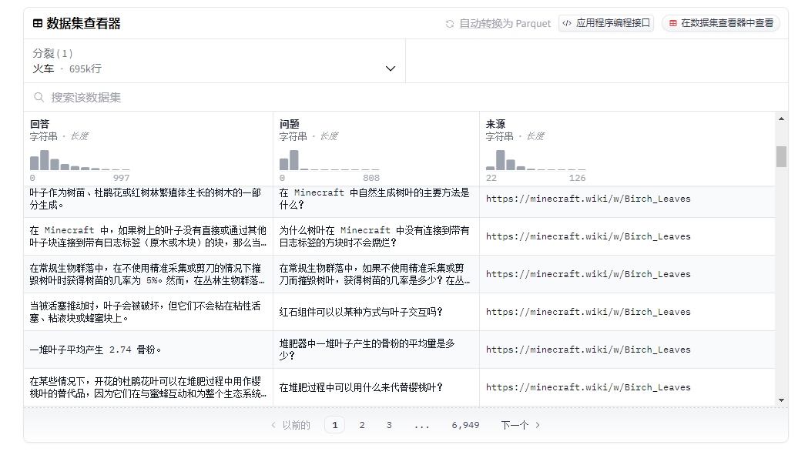

# 收录各种数据集

[COIG-CQIA](https://huggingface.co/datasets/m-a-p/COIG-CQIA)
COIG-CQIA全称为Chinese Open Instruction Generalist - Quality is All You Need， 是一个开源的高质量指令微调数据集，旨在为中文NLP社区提供高质量且符合人类交互行为的指令微调数据。

[minecraft-question-answer-700k](https://huggingface.co/datasets/naklecha/minecraft-question-answer-700k)
最大的综合 Minecraft 问答数据集，涵盖 Minecraft 中的每个主题、游戏机制、物品和工艺。该数据集是通过提取超过 18,000 个 Minecraft wiki 页面。

[PromptMKR](https://hf-mirror.com/datasets/impactframes/PromptMKR/tree/main)
提示词数据集
