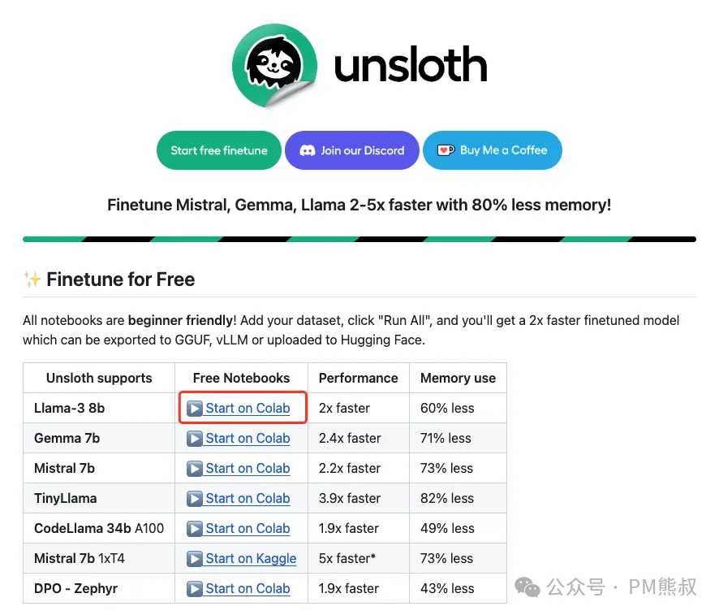
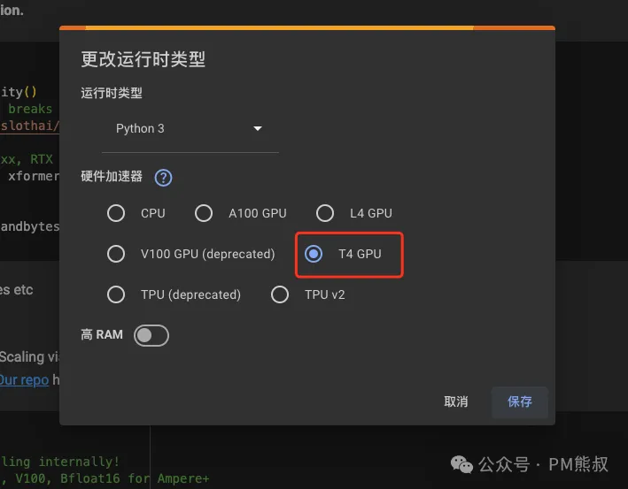
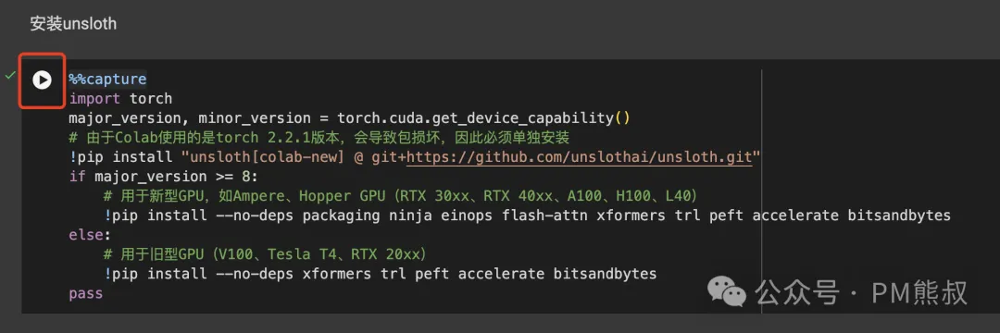
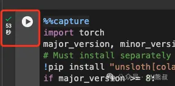
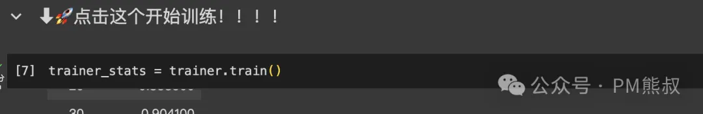
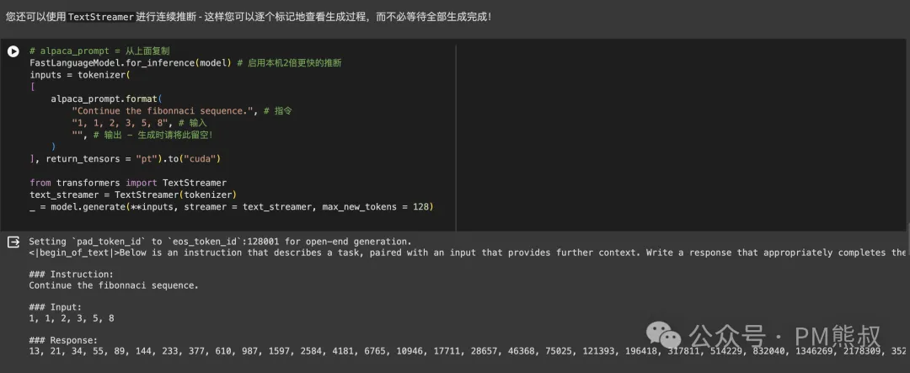
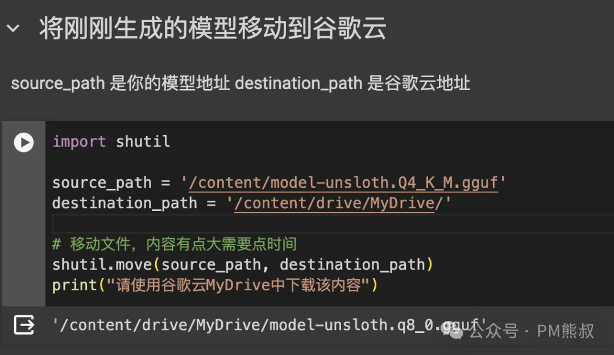
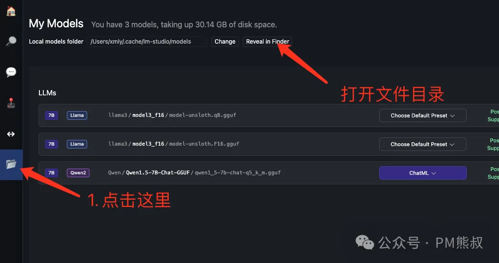

# Llama3 微调教程：超简单，人人都可以打造属于自己的 GPT！

[colab 版](https://mp.weixin.qq.com/s/VV1BUMQIMrb5LxQNusQsDg)

作者：PM 熊叔

随着 Llama 3 的发布，国内各路英雄豪杰纷纷开启了炼丹之旅。Llama-3 8b 在惊人的 15 万亿令牌上训练，而 Llama-2 仅为 2 万亿。毋庸置疑，Llama 3 目前是开源大模型中能力最强的！其跑分成绩已经赶上了 GPT-4。


然而，Llama 的优势不仅限于此。作为开源大模型，每个人都可以对其进行定制，这意味着相比 GPT，它具有更强的定制性和安全性。Llama 可应用于针对 B 端企业的自然语言处理、机器翻译、文本生成、问答系统、聊天机器人等场景。

目前，我们主要通过微调（Fine-Tuning）来定制所需的模型。例如，Llama 3 原生不支持中文，但我们可以通过微调让它支持中文。

微调是指在已经经过大规模预训练的基础模型上，使用特定领域或任务的数据集对模型进行额外训练，以适应特定任务或问题。微调过程通常包括在预训练模型的基础上进行少量迭代训练，以调整模型参数，使其在特定任务上表现更好。

通过这个简单的 Llama 3 微调案例，我们可以体验整个大模型微调的过程。对于普通人来说，这是一个免费体验算法工程师工作方式的机会；如果你想转入 AI 行业，这也是一个很好的入门案例。

愿每个人都能从中受益，开启自己的 AI 探索之旅！

接下来，你将学习如何进行环境配置、数据准备、模型训练、模型运行、模型保存以及本地模型使用。在开始之前，让我们先完成一些准备工作。

准备工作

## 1、访问 Unsloth

目前，最简单的方法是使用 Unsloth，它是一个微调模型的集成工具。通过 Unsloth 微调 Mistral、Gemma、Llama，速度提高 2-5 倍，内存减少 70%！

[访问 Unsloth 的 GitHub 地址](https://github.com/unslothai/unsloth)，点击 "▶️Start on Colab" "即可打开 Colab 训练脚本。



为了方便大家快速上手，我已经将其翻译成[中文并简化](https://colab.research.google.com/drive/1pvzl7E2rdTF7LkDQZOTyl32_Vu9Zwe4N?usp=sharing)

如果你是初学者，建议使用我修改过的 Colab 笔记。


## 2、创建 Colab 笔记副本

使用 Colab 的好处是标准化的环境，免去了很多问题。我们先将笔记复制为副本，这样它能保存到自己的 Google Drive 中。


## 3、连接 T4 GPU

你可以免费使用 Google 提供的 GPU 资源，选择连接 T4。当连接成功后，就可以开始了。


你也可以在弹框中选择 T4 GPU。



当链接成功后，你就准备就绪了。


## 4、连接 Google Drive

我们需要连接 Google Drive，以便将训练好的模型保存到云端。使用 Colab 非常简单，你基本只需依次点击运行每个代码块即可。


5、安装 Unsloth

点击运行，这段代码主要是安装 Unsloth 和模型训练相关的必要库。



展示执行时间表示已经执行过了。



## 步入正题

一切准备就绪，我们要进入正式流程了

### 1. 选择预训练模型

这一段代码主要用于选择我们要训练的模型，代码中已经帮我们选择好了"unsloth/llama-3-8b-bnb-4bit"。继续点击运行，等待模型下载完成。


点击之后，我们会看到它正在下载模型，需要等待它执行完毕。


### 2. 配置 LoRA 参数

我们的微调是通过 LoRA 实现的。LoRA（Low-Rank Adaptation of Large Language Models）是大语言模型的低阶适配器，用于在模型微调过程中只更新整个模型参数的一小部分，通常在 1%到 10%之间。

继续点击运行。


### 3. 准备数据

微调模型最重要的是数据。这里我们使用 yahma 的 Alpaca 数据集，它包含 52,000 条由 OpenAI 的 text-davinci-003 引擎生成的指令和演示数据。这些指令数据可用于对语言模型进行指令调优，使其更好地遵循指令。

Alpaca 的数据结构如下

```
"instruction": "描述原子的结构。",
"input": "",
"output": "原子是所有物质的基本组成部分，由三种类型的粒子组成：质子、中子和电子。原子的结构可以描述为中心有一个原子核，周围环绕着电子云。原子核由质子和中子组成。质子是带正电的粒子，中子是不带电荷的中性粒子……"
```

每条数据，结构由三部分组成：instruction (指令)、input(输入)和 output(输出)，我们可以根据这个格式准备自己的数据集。

instruction（指令）：这部分定义了要求 AI 执行的任务或问题。它是一条明确的指示，告诉 AI 需要做什么。例如，"识别以下句子中的名词"或"我应该投资股票吗？"。

input（输入）：这部分提供了执行指令所需的具体信息或上下文。在某些情况下，这个部分可能为空，表示指令本身已经包含了执行任务所需的所有信息。

output（输出）：这部分是 AI 根据给定的指令和输入生成的答案或结果。它是 AI 处理完输入信息后的响应或解决方案。

继续点击播放，执行代码。


### 4. 训练模型

现在让我们使用 Huggingface TRL 的 SFTTrainer 库来训练模型，我们设置 max_steps 最大步数为 60 步来加快训练速度，让我们继续无脑的点击播放：


然后，就可以开始正式训练模型了。



### 5. 测试训练效果

训练完成后，我们可以测试模型效果。这里我们先让它生成斐波那契数列（Fibonacci sequence）。


你也可以更改指令 instruction 和输入 input，测试你想要的内容。但是注意需要使用英文。

另外，我们还可以使用流格式，像使用 GPT 一样，一个个字地输出。



### 6. 保存模型和加载模型

目前，我们模型已经训练好了，我们可以将刚刚训练的 LoRA 保存下来。

6.1.保存和加载 LoRA 模型

点击运行，将 LoRA 模型保存到 Colab 的临时服务器中。


训练好的 LoRA 模型保存在 lora_model 文件夹中。


如果你想加载刚刚训练的 LoRA 模型进行测试，可以执行相应的代码。


6.2 保存为 GGUF 模型

目前较为常用的模型格式是 GGUF，我们可以使用 LM Studio 在本地加载使用。

这段代码可以将模型保存为不同的精度格式，建议使用 Q4_K，生成的体积比较小，只有 4GB。


生成的模型在这里，但是直接下载比较难。


我们可以执行这段代码，将生成的模型移动到 Google 云端硬盘中，这样下载更方便。



移动完成后，访问 Google 云端硬盘即可下载 GGUF 模型。

地址：https://drive.google.com/drive/my-drive


这样我们微调的整个过程就完成了。恭喜你！

## 本地使用模型

### 1.下载 LM Studio 的客户端

[访问](https://lmstudio.ai) 下载 LM Studio 的客户端，它可以加载我们刚刚训练的模型。


### 2. 导入模型

将 GGUF 文件放到 LM Studio 的模型文件夹中。打开保存模型的文件夹目录：models。



在指定路径中创建文件夹，目录结构为`llama3/model-unsloth/`。在 models 文件夹中新建一个文件夹 llama3，然后再创建一个模型文件夹 model-unsloth，将下载的模型放进去。


设置完成后，重启 LM Studio。

### 3. 开始聊天

选择模型后，就可以开始聊天了。


## 总结

本教程详细介绍了如何使用 Unsloth 和 Google Colab 环境对 Llama 3 进行微调。使用 Colab 基本上是无脑点击运行就好了。

经过这个教程，我们发现微调模型主要有三个核心环节：

数据准备，这一步决定了质量；

模型训练，这一步硬件资源决定了时间；

模型测试，因为我们初步体验，所以比较简略，后续可以进一步探讨。

通过本教程，即使是 AI 领域的新手也能够掌握大模型的微调技术。Unsloth 不仅降低了技术门槛，也为个人和小团队提供了强大的工具。

如果还有问题，可以查看我的 notebook 或者进群讨论。希望你能将这些知识应用于实际问题，解锁更多的可能性。

[模型训练的交流群申请](https://docs.qq.com/form/page/DU1FReEpXdkpKWHlO)

### 参考资料：
[简版](https://mp.weixin.qq.com/s/qcBddyN8srFB0MPh5shgtQ)

[colab版](https://mp.weixin.qq.com/s/VV1BUMQIMrb5LxQNusQsDg)
