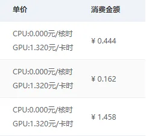
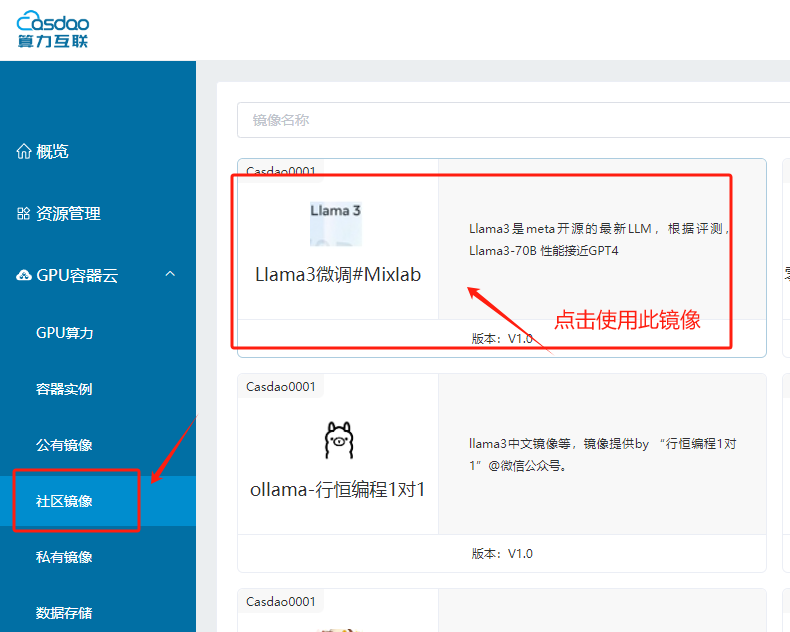
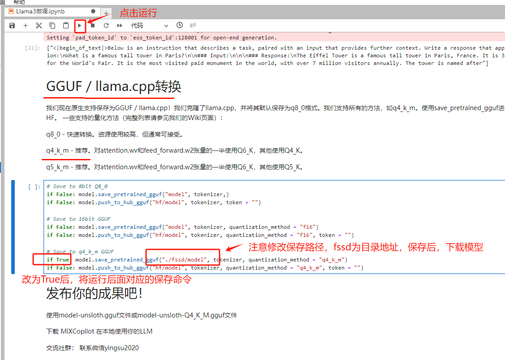

---
---

# 我花了2元，15分钟，零基础入门了Llama3的微调。

[简版](https://mp.weixin.qq.com/s/qcBddyN8srFB0MPh5shgtQ)

作者：shadow

Llama3在最新测评上已经可以接近闭源的GPT4，我们很快就可以拥有属于自己的“GPT4”了！于是，我昨天第一时间体验了Llama3的微调，成本不高，大概花了2元。



[🚀 领取新人算力优惠](https://console.casdao.com:9001/#/s-login?refer=6fad0da0cbf7c12f2242adfd0e2e9eabb95a2e55ff141a3bcf4d6b3853bf2edb)

为了方便大家体验微调，我把需要的系统环境打包成了社区镜像，大家可以一键启用，花15分钟体验Llama3的微调过程。

## 1 / 安装环境
> 使用Mixlab社区提供的 ```Llama3微调镜像```，开箱即用，直接跳到训练那里。


找到Llama3微调镜像


创建实例后，点击```Jupyter```开始你的笔记本


左手边双击打开```Llama3微调.ipynb```

免安装，直接跳到 *第一步*

## 2 / 数据集
> 我们直接体验已经准备好的数据集（如何自定义自己的数据集将在第二期教程中更新）


## 3 / 训练
> 找到下方训练代码的位置，点击运行即可开始训练


## 4 / 测试
> 体验训练完成的新模型


## 5 / 保存模型
> 推荐保存为 GGUF格式，注意，修改保存地址




！恭喜你，你已经入门微调Llama3了。


把模型下载后，使用LM studio，启动模型，并在MiXCopilot中使用，教程 ↓

[（保姆级）MiX Copilot 3.5 下载、安装教程](https://mp.weixin.qq.com/s/Yfz6-wbDdbJtcL5gtch9Qw)


最后，别忘了 [🚀 领取新人算力优惠](https://console.casdao.com:9001/#/s-login?refer=6fad0da0cbf7c12f2242adfd0e2e9eabb95a2e55ff141a3bcf4d6b3853bf2edb)


#### 加入社群

下一期将更新如何训练新的数据集


## 进一步的支持

欢迎申请加入[Llama3 中文爱好者社区](https://docs.qq.com/form/page/DU1FReEpXdkpKWHlO)

访问由 Mixlab 维护的[discord 交流频道](https://discord.gg/cXs9vZSqeK)


### 参考资料：
[简版](https://mp.weixin.qq.com/s/qcBddyN8srFB0MPh5shgtQ)

[colab版](https://mp.weixin.qq.com/s/VV1BUMQIMrb5LxQNusQsDg)